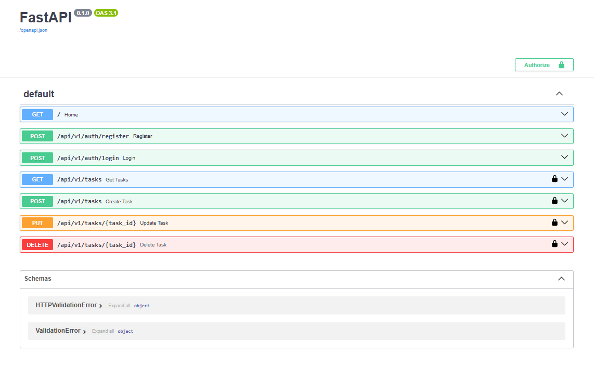
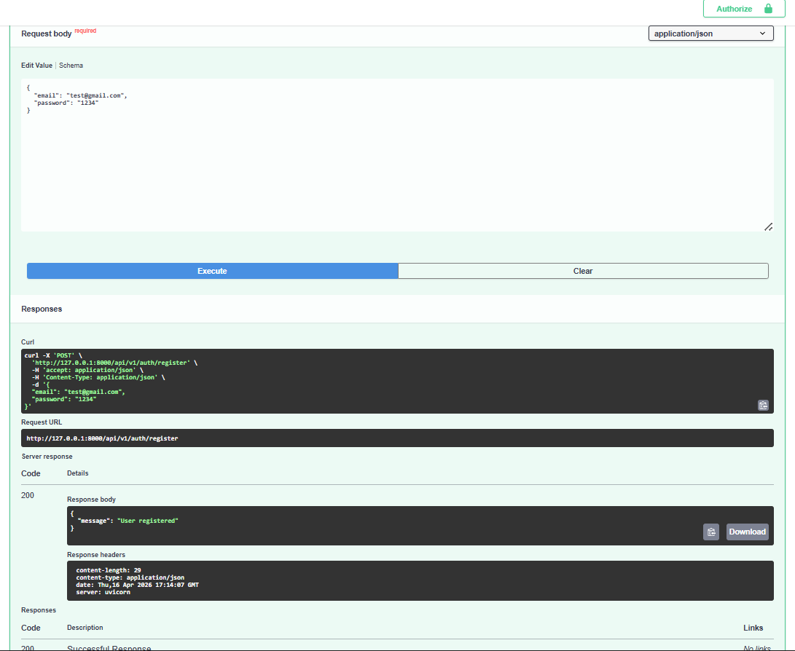
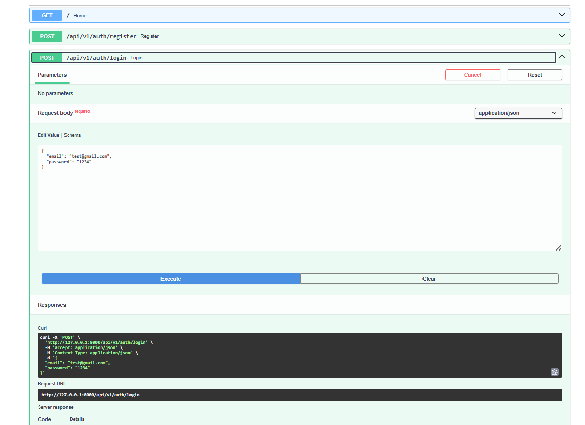
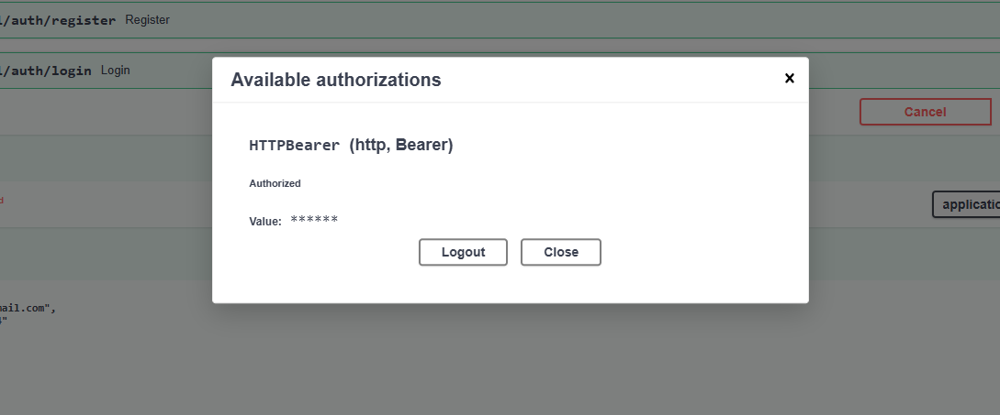
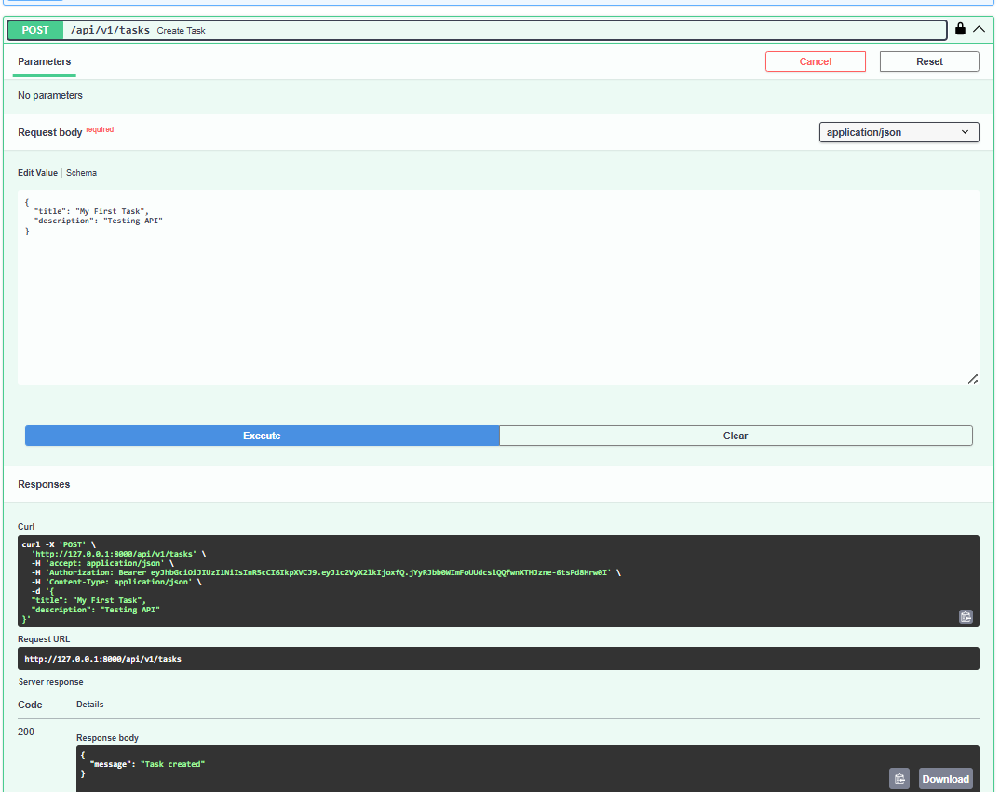
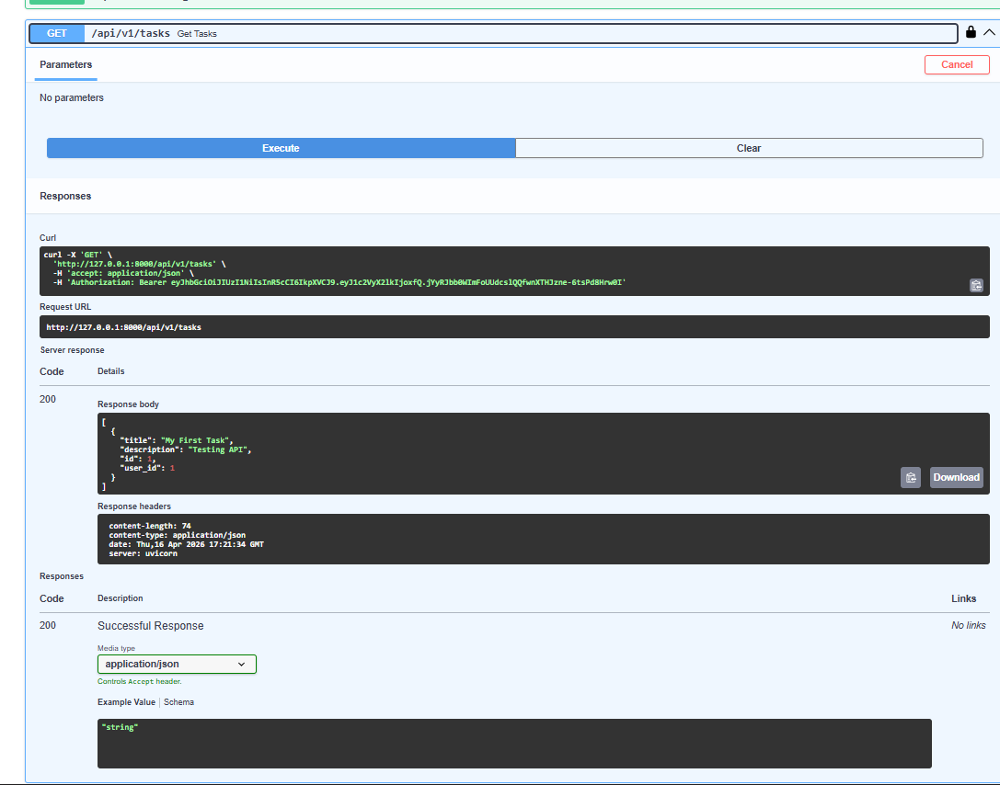

# Task Manager API (FastAPI)

## About the Project

This project is a simple backend system where users can register, log in, and manage their tasks. The main focus was to implement authentication properly using JWT and build clean REST APIs.

I also added a basic frontend to test the APIs, but the backend is the main part.

---

## Features

* User registration and login
* Password hashing (bcrypt)
* JWT-based authentication
* Protected routes
* Task CRUD (Create, Read, Update, Delete)
* Swagger API documentation

---

## Tech Stack

* FastAPI
* SQLite (SQLAlchemy)
* Python
* JWT (python-jose)
* Passlib (bcrypt)

---

## API Endpoints

### Auth

* POST `/api/v1/auth/register`
* POST `/api/v1/auth/login`

### Tasks (Protected)

* GET `/api/v1/tasks`
* POST `/api/v1/tasks`
* PUT `/api/v1/tasks/{task_id}`
* DELETE `/api/v1/tasks/{task_id}`

---

## How to Run

```bash
git clone <your-repo-link>
cd backend
pip install -r requirements.txt
uvicorn main:app --reload
```

Open Swagger:
http://127.0.0.1:8000/docs

---

## How Authentication Works

1. First register a user
2. Then login to get a JWT token
3. Click "Authorize" in Swagger
4. Paste token like:

```
Bearer <your_token>
```

After that, all task APIs will work.

---

## Screenshots

### 1. Swagger UI (API list)



### 2. User Registration Success



### 3. Login + Token Generated



### 4. Authorized (JWT added)



### 5. Create Task Success



### 6. Get Tasks Response



---

## Database Design

Two main tables:

**Users**

* id
* email
* password
* role

**Tasks**

* id
* title
* description
* user_id

Each task is linked to a user.

---

## Scalability Notes

Right now it's a single service, but it can be improved:

* Split into Auth service and Task service
* Use PostgreSQL instead of SQLite
* Add Redis for caching
* Add Docker for deployment
* Add load balancing if traffic increases

---

## Challenges Faced

* JWT authentication handling
* Fixing bcrypt/passlib compatibility issue
* Handling token authorization properly
* Debugging API errors (500 → 401 issues)

---

## Conclusion

This project helped me understand how real backend systems handle authentication, database operations, and API design. It can be extended further with roles, better UI, and deployment.

---

## Note

Frontend is minimal and only used for testing. Main focus is backend API design.
